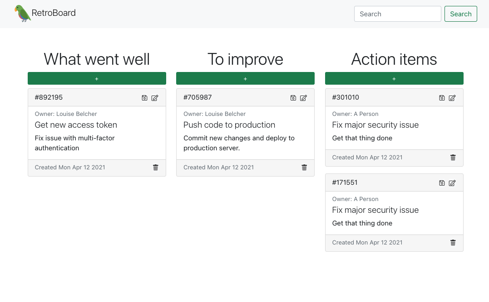

# Retro Board 

## Overview

A clean and simple productivity app!

### Features:

- Add new stories, edit and remove existing stories.
- "Point" system automatically arranges stories by integer value (priority, difficulty, etc...)
- Move cards between columns via drag-n-drop



## Start

### To run from the browser

- Simply open the [GitHub Pages Deployment](https://turbulentrice.github.io/RetroBoard/)!

### To run locally

- Clone this repository to your computer

```shell
git clone https://github.com/TurbulentRice/RetroBoard.git
```

- Move into the directory, and install dependancies

```shell
cd RetroBoard
yarn install
```

- Start the application by serving it locally

```shell
yarn start
```

- Press <kbd>ctrl</kbd>+<kbd>c</kbd> in the terminal to stop the application at any point
